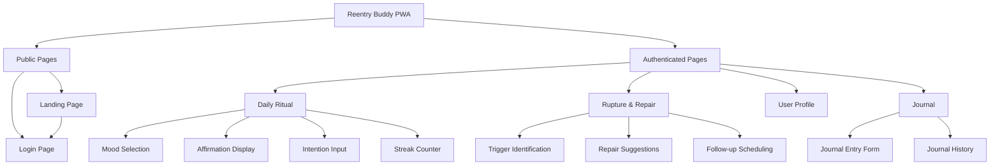
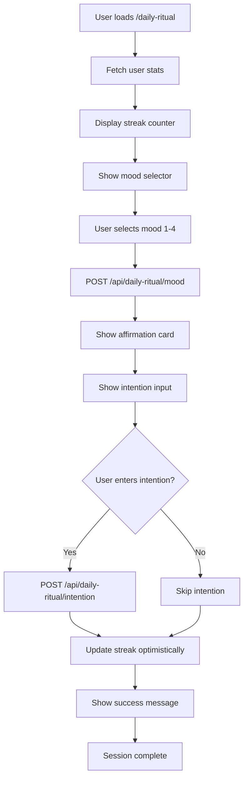

# Reentry Buddy UI/UX Specification

**Version:** v2.0
**Date:** October 12, 2025
**Author:** Sally (UX Expert)
**Status:** In Progress - Updated for PWA MVP

---

## Table of Contents

1. [Introduction](#introduction)
2. [Overall UX Goals & Principles](#overall-ux-goals--principles)
3. [Information Architecture](#information-architecture)
4. [User Flows](#user-flows)
5. [Wireframes & Mockups](#wireframes--mockups)
6. [Component Library / Design System](#component-library--design-system)
7. [Branding & Style Guide](#branding--style-guide)
8. [Accessibility Requirements](#accessibility-requirements)
9. [Responsiveness Strategy](#responsiveness-strategy)
10. [Animation & Micro-interactions](#animation--micro-interactions)
11. [Performance Considerations](#performance-considerations)
12. [Next Steps](#next-steps)
13. [Change Log](#change-log)

---

## Introduction

This document defines the user experience goals, information architecture, user flows, and interface specifications for **Reentry Buddy**'s Progressive Web Application (PWA). It serves as the foundation for the MVP implementation, ensuring a trauma-informed, accessible, and user-centered experience.

### Project Context

Reentry Buddy is a digital recovery support system designed for justice-impacted individuals reentering society after incarceration. The **MVP is a Progressive Web App (PWA)** that provides daily check-ins, streak tracking, rupture & repair flows, and journaling capabilities. The PWA offers an app-like experience accessible through any modern web browser, with offline capabilities and push notifications.

**Note:** SMS and IVR (text messages and voice calls) are deferred to post-MVP phases. This specification focuses exclusively on the PWA interface.

---

## Overall UX Goals & Principles

### Target User Personas

#### Primary User: Returning Citizen (Justice-Impacted Individual)

- **Context:** Within 12 months of release, active substance use recovery, varying digital literacy
- **Device Access:** Smartphone with mobile browser (Android/iOS)
- **Reading Level:** 6th grade or below preferred
- **Trust Level:** Low initial trust in technology and institutions
- **Needs:** Structure, consistency, compassion, non-judgmental support, privacy

### Usability Goals

1. **Low-barrier access:** Users can access via any modern mobile browser without app store installation
2. **Rapid comprehension:** Interface content understandable within 3 seconds
3. **Emotional safety:** Every interaction reinforces progress and provides non-judgmental support
4. **Offline resilience:** Core check-in features work offline with background sync
5. **Respectful privacy:** Users feel confident their information is secure and private

### Design Principles

1. **Radical Simplicity** - Every element serves a clear purpose. Remove all friction.
2. **Compassion First** - Language acknowledges struggle without judgment. "SLIP" not "relapse."
3. **Progressive Disclosure** - Start with the simplest flow; reveal options only when needed.
4. **Consistent Ritual** - Predictable patterns build trust and reduce cognitive load.
5. **Accessible by Default** - Design for the most constrained user; everyone benefits.
6. **Mobile First** - Optimize for touch, limited screen space, and one-handed use.

---

## Information Architecture

### Site Map / Screen Inventory



### Navigation Structure

**Primary Navigation (PWA):**
- **Header Navigation:** Persistent header with app logo, user menu, and "I slipped" button
- **Main Routes:**
  - `/` - Landing page (public)
  - `/login` - Google OAuth login (public)
  - `/daily-ritual` - Daily check-in flow (protected)
  - `/journal` - Journaling feature (protected)
  - `/profile` - User settings (protected, future)
- **Protected Routes:** All authenticated pages redirect to `/login` if user is not authenticated
- **Mobile Navigation:** Bottom navigation bar for main features (future enhancement)

---

## User Flows

### Flow 1: Authentication Flow (Google OAuth)

**User Goal:** Securely sign in to access the application

**Entry Points:**
- "Get Started" button on landing page
- Direct navigation to `/login`
- Redirect from protected routes when unauthenticated

**Success Criteria:**
- User successfully authenticates with Google
- User is redirected to `/daily-ritual` page
- Authentication state persists across sessions

#### Flow Diagram

```mermaid
graph TD
    Start[User visits app] --> A{Authenticated?}
    A -->|No| B[Redirect to /login]
    A -->|Yes| C[Show daily ritual]
    
    B --> D[Show "Sign in with Google" button]
    D --> E[User clicks button]
    E --> F[Navigate to /api/auth/google]
    F --> G[Google OAuth popup/redirect]
    G --> H{Auth successful?}
    
    H -->|Yes| I[Callback to /api/auth/google/callback]
    H -->|No| J[Show error message]
    
    I --> K[Backend creates/finds user]
    K --> L[Set HttpOnly session cookie]
    L --> M[Redirect to /daily-ritual]
    
    J --> D
```

#### Edge Cases & Error Handling

- **Google OAuth failure:** Display user-friendly error: "Unable to sign in with Google. Please try again."
- **Network error:** Show retry option with clear messaging
- **Session expiration:** Automatically redirect to login with message: "Your session has expired. Please sign in again."
- **Callback error:** Log error details and show generic error message to user

**Notes:**
- Session uses HttpOnly cookies for security
- TanStack Query manages global authentication state
- `useAuth` hook provides authentication status throughout app

---

### Flow 2: Daily Ritual Flow (PWA)

**User Goal:** Complete a 2-5 minute grounding check-in to build consistent recovery habits

**Entry Points:**
- Direct navigation to `/daily-ritual` (if authenticated)
- Daily push notification (future)
- Header navigation link

**Success Criteria:**
- User completes mood selection
- User sees personalized affirmation
- Session logged with streak update
- Intention optionally saved

#### Flow Diagram



#### Edge Cases & Error Handling

- **API failure on mood submit:** Show error alert with retry button, preserve user selection
- **Network offline:** Queue request for background sync when connection restored
- **Stats fetch failure:** Allow check-in to proceed, show warning banner
- **Duplicate check-in same day:** Show message: "You've already checked in today! Come back tomorrow."
- **Loading states:** Display skeleton screens during all data fetches

**Notes:**
- Affirmation content varies based on mood (1-4) to feel personalized
- Streak milestones (5, 10, 30 days) trigger celebration toasts
- Intention is optional—UI makes this clear with "Skip" option
- Optimistic updates make UI feel instant


---

### Flow 3: Rupture & Repair Flow (PWA)

**User Goal:** Receive compassionate, non-judgmental support after a relapse moment

**Entry Points:**
- "I slipped" button in header (always visible when authenticated)
- Direct navigation to repair flow

**Success Criteria:**
- User completes repair flow in modal/dedicated view
- User identifies trigger
- User sees personalized repair suggestion
- Streak reset gracefully with supportive messaging

#### Flow Diagram

```mermaid
graph TD
    Start[User clicks "I slipped" button] --> A[Open repair flow modal]
    A --> B[Show immediate empathetic message]
    
    B --> C[POST /api/repair/start]
    C --> D[Display trigger selection]
    
    D --> E[User selects trigger type]
    E --> F[Stress/People/Craving/Other]
    
    F --> G[Show personalized repair suggestions]
    G --> H[Display 3 actionable steps]
    
    H --> I{User selects action?}
    I -->|Yes| J[Acknowledge selection]
    I -->|No/Skip| K[Show supportive closing]
    
    J --> K
    K --> L[Update streak gracefully]
    L --> M[Show closing message]
    M --> N[Close modal/return to home]
```

#### Edge Cases & Error Handling

- **API failure:** Allow user to complete flow locally, sync when connection restored
- **Multiple slips same day:** Allow repeat access, show: "We're still here with you."
- **Network offline:** Queue repair session for background sync
- **User closes modal mid-flow:** Save progress, allow resume later

**Notes:**
- "Reset streak gracefully" messaging: "Your [X]-day progress isn't lost—you're building skills every day. Let's start fresh tomorrow."
- Repair suggestions are micro-actions: "Take 3 deep breaths," "Drink a glass of water," "Call someone who cares"
- Flow is entirely self-contained in one view for simplicity
- Crisis resources link always visible: "If you're in crisis, call 988 (Suicide & Crisis Lifeline)"

---

### Flow 4: Journaling Feature (PWA)

**User Goal:** Reflect on recovery journey through private journaling

**Entry Points:**
- Navigation to `/journal` page
- "Add Entry" button from journal history

**Success Criteria:**
- User can create new journal entry
- Entry is saved with timestamp
- User can view past entries
- All entries are private and secure

#### Flow Diagram

```mermaid
graph TD
    Start[User navigates to /journal] --> A[Load journal history]
    A --> B[Display recent entries]
    
    B --> C[User clicks "New Entry"]
    C --> D[Show journal entry form]
    
    D --> E[User writes entry]
    E --> F[User clicks "Save"]
    
    F --> G[POST /api/journal]
    G --> H{Save successful?}
    
    H -->|Yes| I[Show success toast]
    H -->|No| J[Show error, preserve text]
    
    I --> K[Return to journal list]
    K --> L[Show new entry in list]
    
    J --> M[Offer retry]
```

#### Edge Cases & Error Handling

- **Network offline:** Save draft locally, sync when online
- **Long entry:** No character limit, but show character count
- **Empty entry:** Require at least 10 characters
- **API failure:** Preserve text in form, allow retry
- **Draft persistence:** Auto-save draft every 30 seconds

**Notes:**
- Journal entries use `contentType: 'journal_entry'` in interactions table
- Entries are timestamped and sortable
- Future: Add tags/categories for entries
- Future: Search functionality across entries

---

## Wireframes & Mockups

### Primary Design Files

**Design Tool:** Figma (or similar) for high-fidelity mockups
**Component Library:** shadcn/ui (already implemented in project)
**Prototype Location:** `/docs/wireframes/` (to be created)

---

### Key Screen Layouts (PWA Views)

#### Screen 1: Login Page (`/login`)

**Purpose:** Authenticate users via Google OAuth

```
┌─────────────────────────────────┐
│  Reentry Buddy          9:00 AM │
├─────────────────────────────────┤
│                                 │
│  ┌───────────────────────────┐ │
│  │ Good morning! How are you │ │
│  │ feeling today?            │ │
│  │                           │ │
│  │ 1 = Struggling            │ │
│  │ 2 = Getting by            │ │
│  │ 3 = Good                  │ │
│  │ 4 = Great                 │ │
│  └───────────────────────────┘ │
│                                 │
│              ┌────────────────┐ │
│              │ 2              │ │
│              └────────────────┘ │
│                        9:02 AM  │
│                                 │
│  ┌───────────────────────────┐ │
│  │ Getting by is honest.     │ │
│  │ That takes strength.      │ │
│  └───────────────────────────┘ │
│                                 │
│  ┌───────────────────────────┐ │
│  │ Want to set an intention  │ │
│  │ for today? (Optional -    │ │
│  │ just reply or skip)       │ │
│  └───────────────────────────┘ │
│                                 │
│              ┌────────────────┐ │
│              │ Stay calm      │ │
│              └────────────────┘ │
│                        9:04 AM  │
│                                 │
│  ┌───────────────────────────┐ │
│  │ "Stay calm" - got it. We  │ │
│  │ believe in you. Talk      │ │
│  │ tomorrow!                 │ │
│  └───────────────────────────┘ │
└─────────────────────────────────┘
```

---

#### Screen 2: Daily Ritual Page (`/daily-ritual`)

**Purpose:** Complete daily check-in with mood selection and intention

```
┌─────────────────────────────────────┐
│  ☰  Reentry Buddy    [I slipped] 👤 │  ← Header with slip button
├─────────────────────────────────────┤
│                                     │
│        Daily Ritual                 │  ← Page title
│    Your space for daily reflection  │
│                                     │
│  ┌───────────────────────────────┐ │
│  │   🔥 Current Streak           │ │
│  │                               │ │
│  │         12 days               │ │  ← Streak counter
│  │                               │ │
│  └───────────────────────────────┘ │
│                                     │
│  How are you feeling today?         │  ← Mood prompt
│                                     │
│  ┌─────────┐  ┌─────────┐          │
│  │    😔   │  │    😐   │          │  ← Mood buttons
│  │         │  │         │          │     (large touch targets)
│  │Strugg-  │  │Getting  │          │
│  │ling     │  │  by     │          │
│  │    1    │  │    2    │          │
│  └─────────┘  └─────────┘          │
│                                     │
│  ┌─────────┐  ┌─────────┐          │
│  │    🙂   │  │    😊   │          │
│  │         │  │         │          │
│  │  Good   │  │  Great  │          │
│  │    3    │  │    4    │          │
│  └─────────┘  └─────────┘          │
│                                     │
└─────────────────────────────────────┘

[After mood selection, shows:]

┌─────────────────────────────────────┐
│  ☰  Reentry Buddy    [I slipped] 👤 │
├─────────────────────────────────────┤
│                                     │
│  ┌───────────────────────────────┐ │
│  │                               │ │
│  │   Getting by is honest.       │ │  ← Affirmation card
│  │   That takes strength.        │ │
│  │                               │ │
│  └───────────────────────────────┘ │
│                                     │
│  Set an intention for today?        │  ← Optional intention
│  (Optional - you can skip)          │
│                                     │
│  ┌───────────────────────────────┐ │
│  │ Type your intention...        │ │  ← Text input
│  │                               │ │
│  └───────────────────────────────┘ │
│                                     │
│  [Save]              [Skip]         │  ← Action buttons
│                                     │
└─────────────────────────────────────┘
```

**Key Elements:**
- Persistent header with "I slipped" button always visible
- Large, emoji-based mood buttons for easy selection
- Streak counter for motivation
- Affirmation appears after mood selection
- Optional intention input with clear skip option
- Mobile-optimized touch targets

---

#### Screen 3: Rupture & Repair Modal

**Purpose:** Provide immediate compassionate support after a slip

```
┌─────────────────────────────────────┐
│  ☰  Reentry Buddy    [I slipped] 👤 │
├─────────────────────────────────────┤
│  ╔═══════════════════════════════╗ │
│  ║                               ║ │  ← Modal overlay
│  ║  [×]                          ║ │     (close button)
│  ║                               ║ │
│  ║   We're here with you. 💙      ║ │  ← Immediate empathy
│  ║   You're not alone.           ║ │
│  ║                               ║ │
│  ║  ─────────────────────────    ║ │
│  ║                               ║ │
│  ║   Slips happen. What matters  ║ │  ← Reframe
│  ║   is what comes next.         ║ │
│  ║                               ║ │
│  ║  ─────────────────────────    ║ │
│  ║                               ║ │
│  ║   What triggered this?        ║ │  ← Trigger selection
│  ║   (You can also skip)         ║ │
│  ║                               ║ │
│  ║   ┌───────────┐ ┌──────────┐ ║ │
│  ║   │  Stress   │ │  People  │ ║ │  ← Trigger options
│  ║   └───────────┘ └──────────┘ ║ │
│  ║   ┌───────────┐ ┌──────────┐ ║ │
│  ║   │  Craving  │ │   Other  │ ║ │
│  ║   └───────────┘ └──────────┘ ║ │
│  ║                               ║ │
│  ║   [Skip]                      ║ │
│  ║                               ║ │
│  ╚═══════════════════════════════╝ │
│                                     │
└─────────────────────────────────────┘

[After trigger selection:]

┌─────────────────────────────────────┐
│  ╔═══════════════════════════════╗ │
│  ║  [×]                          ║ │
│  ║                               ║ │
│  ║   That's really hard.         ║ │  ← Acknowledge
│  ║   Stress can be overwhelming. ║ │
│  ║                               ║ │
│  ║  Here are 3 things you can    ║ │  ← Repair suggestions
│  ║  do right now:                ║ │
│  ║                               ║ │
│  ║  • Take 5 deep breaths        ║ │
│  ║  • Drink a glass of water     ║ │
│  ║  • Call someone who cares     ║ │
│  ║                               ║ │
│  ║  Which one feels doable?      ║ │
│  ║                               ║ │
│  ║  ┌─────┐ ┌──────┐ ┌────────┐ ║ │
│  ║  │Breath││Water│ │ Call   │ ║ │  ← Action buttons
│  ║  └─────┘ └──────┘ └────────┘ ║ │
│  ║                               ║ │
│  ║  [Skip]                       ║ │
│  ║                               ║ │
│  ╚═══════════════════════════════╝ │
└─────────────────────────────────────┘

[Final screen:]

┌─────────────────────────────────────┐
│  ╔═══════════════════════════════╗ │
│  ║  [×]                          ║ │
│  ║                               ║ │
│  ║   Good choice.                ║ │  ← Closing message
│  ║                               ║ │
│  ║   Your 12-day progress isn't  ║ │  ← Graceful reset
│  ║   lost—you're building skills ║ │
│  ║   every day.                  ║ │
│  ║                               ║ │
│  ║   Let's start fresh tomorrow. ║ │
│  ║                               ║ │
│  ║   We'll check in with you.    ║ │
│  ║   You matter to us.           ║ │
│  ║                               ║ │
│  ║  [Close]                      ║ │  ← Close modal
│  ║                               ║ │
│  ╚═══════════════════════════════╝ │
└─────────────────────────────────────┘
```

**Key Elements:**
- Full-screen modal for focus and privacy
- Multi-step flow with clear progression
- Trigger-specific empathetic responses
- Actionable, simple repair suggestions
- Graceful streak reset messaging
- Crisis hotline link visible at bottom (988)
│  └───────────────────────────┘ │
│                                 │
│  ┌───────────────────────────┐ │
│  │ We'll check back in a     │ │
│  │ week. Text START anytime  │ │
│  │ you're ready.             │ │
│  │                           │ │
│  │ You matter to us.         │ │
│  └───────────────────────────┘ │
└─────────────────────────────────┘
```

---

#### Screen 4: Admin Dashboard - Overview (Web Interface)

**Purpose:** Provide coaches with weekly aggregate insights without exposing PII

```
┌─────────────────────────────────────────────────────────────┐
│  Reentry Buddy Admin Dashboard        [Week: Oct 3-9, 2025] │
├─────────────────────────────────────────────────────────────┤
│                                                               │
│  ┌──────────────┐  ┌──────────────┐  ┌──────────────┐      │
│  │ Active Users │  │ Check-in Rate│  │ SLIP Events  │      │
│  │              │  │              │  │              │      │
│  │     42       │  │     78%      │  │      5       │      │
│  │   ↑ +3       │  │   ↑ +5%      │  │   ↓ -2       │      │
│  └──────────────┘  └──────────────┘  └──────────────┘      │
│                                                               │
│  ┌─────────────────────────────────────────────────────┐    │
│  │ Mood Trends (Aggregate - This Week)                 │    │
│  │                                                      │    │
│  │  [Bar Chart showing distribution]                   │    │
│  │  Struggling (1): ███████ 18%                        │    │
│  │  Getting By (2): ████████████████ 42%               │    │
│  │  Good (3):       ██████████ 28%                     │    │
│  │  Great (4):      ████ 12%                           │    │
│  └─────────────────────────────────────────────────────┘    │
│                                                               │
│  ┌───────────────────────┐  ┌────────────────────────────┐  │
│  │ Engagement Patterns   │  │ System Health              │  │
│  │                       │  │                            │  │
│  │ Streak Milestones:    │  │ ✅ SMS Delivery: 99.2%     │  │
│  │  • 5 days:  8 users   │  │ ✅ IVR Availability: 100%  │  │
│  │  • 10 days: 6 users   │  │ ✅ Avg Response: 2.3s      │  │
│  │  • 30 days: 2 users   │  │                            │  │
│  │                       │  │                            │  │
│  │ Re-engagement:        │  │ [View Error Log]           │  │
│  │  • Returned: 4 users  │  │                            │  │
│  │  • On break: 7 users  │  │                            │  │
│  └───────────────────────┘  └────────────────────────────┘  │
│                                                               │
│  [Export Weekly Report]  [View Previous Weeks]               │
│                                                               │
└─────────────────────────────────────────────────────────────┘
```

---

## Component Library / Design System

### Design System Approach

**Current Implementation:** shadcn/ui (React-based component library)
**Styling:** Tailwind CSS with custom theme configuration
**Icons:** Lucide React  
**Location:** `client/src/components/ui/`

The project already uses shadcn/ui, which provides accessible, customizable components built on Radix UI primitives. All new components should follow these established patterns.

---

### Core PWA Component Patterns

#### Pattern 1: Mood Selector Component

**Purpose:** Allow users to select their current mood state

**Location:** `client/src/components/daily-ritual/MoodSelector.tsx`

**Structure:**
```tsx
interface MoodSelectorProps {
  onSelectMood: (mood: MoodOption) => void;
}
```

**Design Guidelines:**
- 4 large, tappable buttons in 2x2 grid
- Each button shows emoji + text label + number
- Minimum 56px touch target (accessibility)
- Clear visual feedback on hover/press
- Mobile-first responsive design

**Usage Examples:**
- Primary use: Daily Ritual page mood selection
- Reusable for any mood-tracking features

---

#### Pattern 2: Affirmation Card Component

**Purpose:** Display personalized affirmation after mood selection

**Location:** `client/src/components/daily-ritual/AffirmationCard.tsx`

**Structure:**
```tsx
interface AffirmationCardProps {
  affirmation: string;
  mood?: MoodOption; // Optional for styling variation
}
```

**Design Guidelines:**
- Card with gentle background color based on mood
- Centered text with comfortable line height (1.6)
- Fade-in animation (300ms)
- Optional icon/emoji accent
- Max-width 400px for readability

**Mood-Specific Styling:**
- Mood 1 (Struggling): Soft purple background, supportive messaging
- Mood 2 (Getting by): Neutral blue background, affirming messaging
- Mood 3-4 (Good/Great): Light green background, celebratory messaging

---

#### Pattern 3: Streak Counter Component

**Purpose:** Display user's current check-in streak

**Location:** `client/src/components/daily-ritual/StreakCounter.tsx`

**Structure:**
```tsx
interface StreakCounterProps {
  streak: number;
  showMilestone?: boolean;
}
```

**Design Guidelines:**
- Prominent fire emoji (🔥) or custom streak icon
- Large number display (2rem minimum)
- Subtle animation on milestone achievements (5, 10, 30, 60 days)
- Card container with gentle shadow

**Milestone Celebrations:**
- 5 days: Subtle pulse animation + toast notification
- 10 days: Confetti animation + congratulatory message
- 30+ days: Special badge + extended celebration

---

#### Pattern 4: Repair Flow Modal Component

**Purpose:** Multi-step compassionate support flow after slip

**Location:** `client/src/components/repair/RepairFlow.tsx`

**Structure:**
```tsx
interface RepairFlowProps {
  isOpen: boolean;
  onClose: () => void;
  onComplete: (data: RepairData) => void;
}
```

**Design Guidelines:**
- Full-screen modal overlay for focus
- Multi-step wizard pattern (3-4 steps)
- Progress indicator at top
- Large, clear action buttons
- Skip option always visible
- Crisis resources link in footer

**Flow Steps:**
1. Immediate empathy message
2. Trigger identification (optional)
3. Repair suggestions (3 actionable items)
4. Closing message with streak reset

---

#### Pattern 5: Journal Entry Component

**Purpose:** Create and display journal entries

**Location:** `client/src/components/journal/JournalEntry.tsx`

**Structure:**
```tsx
interface JournalEntryProps {
  entry?: JournalEntry;
  onSave: (text: string) => void;
  onCancel: () => void;
  isEditing: boolean;
}
```

**Design Guidelines:**
- Auto-expanding textarea
- Character count indicator
- Auto-save draft every 30 seconds
- Encouraging prompt/tip below text area
- Clear save/cancel buttons
- Timestamp display when viewing

**Entry List Pattern:**
- Reverse chronological order (newest first)
- Preview with "Read more" truncation
- Date/time badge
- Gentle hover effect

---

## Branding & Style Guide

### Visual Identity

**User-Facing Brand:** **Reentry Buddy**
- Tone: Warm, friendly, accessible
- Voice: First-person ("we"), conversational
- Purpose: Build trust and emotional connection

**Institutional Brand:** **Reentry Companion**
- Tone: Professional, respectful, evidence-based
- Voice: Third-person formal (for grants, partnerships)
- Purpose: Establish credibility with funders and institutions

**Brand Guidelines:** To be developed in future sprint

---

### Color Palette (PWA Application)

The application uses a carefully chosen palette that promotes calm and emotional safety.

| Color Type | Hex Code | Tailwind Class | Usage |
|------------|----------|----------------|-------|
| Primary | #2563EB | blue-600 | Primary buttons, links, active states |
| Secondary | #7C3AED | purple-600 | Secondary actions, accents |
| Accent (Success) | #10B981 | emerald-500 | Success states, streak achievements, positive metrics |
| Mood: Struggling | #9333EA | purple-600 | Mood 1 affirmations, repair flow |
| Mood: Getting By | #3B82F6 | blue-500 | Mood 2 affirmations |
| Mood: Good/Great | #10B981 | emerald-500 | Mood 3-4 affirmations |
| Warning | #F59E0B | amber-500 | Cautions, approaching limits |
| Error | #DC2626 | red-600 | Errors, critical actions |
| Neutral Gray | #6B7280 | gray-500 | Text, borders, backgrounds |
| Background | #F9FAFB | gray-50 | Page background |
| Surface | #FFFFFF | white | Cards, modals, elevated surfaces |

**Accessibility Note:** All color combinations meet WCAG 2.1 AA contrast requirements (4.5:1 for normal text, 3:1 for large text).

---

### Typography

#### Font Families
- **Primary (UI):** System font stack: `-apple-system, BlinkMacSystemFont, 'Segoe UI', Roboto, 'Helvetica Neue', Arial, sans-serif`
- **Headings:** Same as primary (consistency)
- **Monospace (code/technical):** `ui-monospace, SFMono-Regular, 'SF Mono', Menlo, Consolas, monospace`

**Rationale:** System fonts provide optimal performance, native feel, and excellent readability across all devices.

#### Type Scale (Tailwind-based)

| Element | Size | Tailwind Class | Weight | Line Height |
|---------|------|----------------|--------|-------------|
| H1 (Page Title) | 30px / 1.875rem | text-3xl | font-bold (700) | leading-tight (1.25) |
| H2 (Section) | 24px / 1.5rem | text-2xl | font-semibold (600) | leading-snug (1.375) |
| H3 (Subsection) | 20px / 1.25rem | text-xl | font-semibold (600) | leading-snug (1.375) |
| Body | 16px / 1rem | text-base | font-normal (400) | leading-relaxed (1.625) |
| Small | 14px / 0.875rem | text-sm | font-normal (400) | leading-normal (1.5) |
| Tiny | 12px / 0.75rem | text-xs | font-normal (400) | leading-normal (1.5) |

**Reading Level Consideration:** All user-facing content should be written at or below 6th-grade reading level.

---

### Iconography

**Icon Library:** Lucide React (already implemented)
**Location:** Imported from `lucide-react` package

**Usage Guidelines:**
- Use icons sparingly—only when they enhance comprehension
- Always pair icons with text labels for accessibility
- 20px minimum touch target for interactive icons
- 24px default size for most icons
- Use consistent stroke-width (2px default)

**Commonly Used Icons:**
- Check-in: `Calendar`, `Heart`
- Mood: Emoji (😔 😐 🙂 😊) not icons
- Slip button: `AlertCircle` or `LifeBuoy`
- Journal: `BookOpen`, `PenTool`
- Profile: `User`
- Logout: `LogOut`
- Close: `X`
- Navigation: `Menu`, `ChevronRight`, `ChevronLeft`

**Emoji Usage:**
- Fire emoji (🔥) for streaks
- Blue heart (💙) for empathy/support messages
- Sparkles (✨) for major milestones (30+ days)

---

### Spacing & Layout

**Grid System:** 4px base unit (Tailwind default)

**Spacing Scale (Tailwind):**
- 1: 4px
- 2: 8px
- 3: 12px
- 4: 16px
- 6: 24px
- 8: 32px
- 12: 48px
- 16: 64px

**PWA Layout Constraints:**
- Max content width: 768px (tablet width) for optimal readability
- Side padding: 16px (mobile), 24px (tablet+)
- Card spacing: 16px gap between cards
- Section spacing: 32px-48px vertical gaps
- Component internal padding: 16px-24px

---

### Content & Voice Guidelines

Since users primarily interact through the web interface, tone and language are critical:

#### Tone Principles
1. **Conversational, not clinical:** "We're here with you" not "Session initiated"
2. **Direct, not vague:** "Click the button" not "Consider selecting the option if desired"
3. **Affirming, not judgmental:** "Getting by is honest" not "You should feel better"
4. **Brief but complete:** Clear without being terse
5. **Empowering, not patronizing:** "You're building skills" not "Good job!"

#### Language Rules
- **Reading level:** 6th grade or below
- **Sentence structure:** Subject-verb-object (simple)
- **Word choice:** Common words, avoid jargon
- **Active voice preferred:** "You're building" not "Skills are being built"
- **Contractions okay:** "you're" not "you are" (more natural)
- **Contractions:** Use naturally ("you're" not "you are")

#### Forbidden Words/Phrases
- ❌ "Relapse" → Use "SLIP"
- ❌ "Failure" → Use "tough moment"
- ❌ "Missed" → Use "we miss you"
- ❌ "Streak broken" → Use "let's start fresh"
- ❌ "Try harder" → Use "take it one day at a time"

---

## Accessibility Requirements

### Compliance Target

**Standard:** WCAG 2.1 Level AA (minimum)

**Rationale:** Level AA is the industry standard for public-facing digital tools and ensures broad accessibility without the complexity of AAA requirements.

---

### Key Requirements

#### Visual Accessibility

**Color contrast ratios:**
- Normal text (16px): 4.5:1 minimum
- Large text (18px+ or 14px+ bold): 3:1 minimum
- Interactive elements: 3:1 minimum for borders and icons
- All color combinations in the palette meet these ratios

**Focus indicators:**
- Visible keyboard focus outline (2px solid ring, high-contrast color)
- Focus order follows logical page structure (top-to-bottom, left-to-right)
- Custom focus styles using Tailwind's `focus:ring-2 focus:ring-blue-500`
- Skip-to-main-content link for keyboard users

**Text sizing & zoom:**
- User can zoom to 200% without loss of functionality
- No fixed pixel heights on text containers
- Responsive breakpoints preserve readability
- Minimum 16px base font size

**Color independence:**
- Never rely on color alone to convey information
- Use icons, text labels, or patterns in addition to color
- Error states use both red color AND error icon + text

#### Interaction & Navigation

**Keyboard navigation:**
- All interactive elements reachable via Tab key
- Enter/Space activates buttons and links
- Escape closes modals and dropdowns
- Arrow keys navigate within components (mood selector, trigger buttons)
- Modal focus trap (focus stays within modal when open)

**Screen reader support:**
- Semantic HTML5 elements (`<nav>`, `<main>`, `<article>`, `<section>`, `<button>`)
- ARIA labels for icon-only buttons: `<button aria-label=\"I slipped\">`
- ARIA live regions for dynamic content: toast notifications, streak updates
- Form inputs have associated `<label>` elements
- Loading states announced: `aria-live=\"polite\"` for data fetching

**Touch targets (mobile-first):**
- Minimum 44×44px touch target for all interactive elements
- 48×48px preferred for primary actions
- 8px minimum spacing between adjacent touch targets
- Mood selector buttons: 56×56px minimum

#### Content Accessibility

**Alternative text:**
- Decorative images/icons use `alt=\"\"` (null alt)
- Meaningful images have descriptive alt text
- Icon buttons have `aria-label` attributes
- SVG icons use `aria-hidden=\"true\"` when paired with text

**Heading structure:**
- Logical hierarchy (H1 → H2 → H3, no skipping levels)
- One H1 per page (page title)
- Headings describe content accurately
- `DailyRitual` page: H1 \"Daily Ritual\", H2 for sections

**Form labels & errors:**
- Every input has visible `<label>` element
- Error messages use `aria-describedby` to associate with fields
- Required fields indicated with `aria-required=\"true\"` and visual indicator
- Success/error states announced to screen readers

**Loading & empty states:**
- Loading spinners have `aria-label=\"Loading...\"`
- Empty states provide helpful messaging: \"No journal entries yet. Create your first entry!\"
- Skeleton screens for perceived performance

---

### PWA-Specific Accessibility Considerations

**Progressive Enhancement:**
- Core functionality works without JavaScript (forms submit, links navigate)
- JavaScript enhances experience (optimistic updates, animations)
- Offline mode gracefully degrades with clear messaging

**Mobile Accessibility:**
- Large touch targets (44×44px minimum)
- Sufficient contrast for outdoor viewing
- Readable text sizes without pinch-zoom
- No horizontal scrolling required
- One-handed operation possible for core tasks

**Cognitive Accessibility:**
- Simple, clear language (6th-grade reading level)
- Consistent navigation and interaction patterns
- Gentle, non-distracting animations
- Ample time for interactions (no auto-timeouts on critical actions)
- Option to \"Skip\" any optional steps

**Crisis Support Accessibility:**
- 988 crisis hotline link always visible in repair flow
- Link opens phone dialer on mobile devices
- Clear, large text for crisis resources
- High-priority keyboard focus order

---

### Testing Strategy

**Automated Testing:**
1. **axe DevTools** (browser extension) - Run during development on every component
2. **Lighthouse accessibility audit** - Part of CI/CD pipeline, must score 95+
3. **eslint-plugin-jsx-a11y** - Catches accessibility issues during development
4. **Vitest + @testing-library/react** - Unit tests include accessibility assertions

**Manual Testing:**
1. **Keyboard-only navigation test:**
   - Unplug mouse, navigate entire app with keyboard only
   - Test all interactive elements, modals, forms
   - Verify focus order is logical
   
2. **Screen reader test:**
   - **macOS:** VoiceOver (Cmd+F5 to enable)
   - **Windows:** NVDA (free, open-source)
   - **iOS:** VoiceOver (Settings > Accessibility)
   - **Android:** TalkBack (Settings > Accessibility)
   
3. **Color contrast validation:**
   - WebAIM Contrast Checker
   - Browser DevTools contrast tool
   - Test with color blindness simulators
   
4. **Zoom test:**
   - Test at 200% browser zoom
   - Test with OS-level zoom enabled
   - Verify no horizontal scrolling, all content accessible

**User Testing:**
- Include at least 1-2 users with disabilities in usability testing
- Test with users who rely on screen readers
- Test with users who navigate keyboard-only
- Gather feedback on cognitive load and clarity
   - Color contrast validation (WebAIM contrast checker)
   - Zoom test (200% browser zoom)

3. **User testing:**
   - Include at least 1 user with disabilities in pilot testing
   - Test with assistive technologies (screen reader, magnification)

**SMS/IVR Testing:**
1. **Device testing:**
   - Test message display on basic phone screen readers (Android TalkBack, iOS VoiceOver)
   - Validate IVR prompts with slow playback speed option

2. **Cognitive load testing:**
   - Flesch-Kincaid readability score target: 6th grade or below
   - User testing with participants with varying literacy levels
   - Ensure numbered options don't exceed 4 choices (cognitive overload)

3. **Motor accessibility testing:**
   - Validate DTMF tone input on various phone models
   - Ensure generous timeout periods (no rushed responses required)

---

## Responsiveness Strategy

### Mobile-First Approach

The PWA is designed with a mobile-first philosophy, as most users will access it via smartphone.

### Breakpoints (Tailwind CSS)

| Breakpoint | Min Width | Tailwind Class | Target Devices |
|------------|-----------|----------------|----------------|
| Mobile (default) | 0px | (none) | Smartphones (portrait) |
| sm | 640px | sm: | Smartphones (landscape), large phones |
| md | 768px | md: | Tablets (portrait) |
| lg | 1024px | lg: | Tablets (landscape), small laptops |
| xl | 1280px | xl: | Desktops, large screens |
| 2xl | 1536px | 2xl: | Large desktops (rarely needed) |

---

### Adaptation Patterns by Screen Size

**Mobile (0-639px) - PRIMARY TARGET:**
- Single-column layout throughout
- Full-width cards (16px side padding)
- Mood buttons in 2×2 grid (large touch targets)
- Bottom spacing for iOS safe area
- Fixed header with sticky "I slipped" button
- Modals take full screen height

**Tablet (640-1023px):**
- Max content width: 640px, centered
- Mood buttons slightly larger with more spacing
- Journal entries in 2-column grid on wider tablets
- Repair modal uses centered card (not full-screen)
- Side padding increased to 24px

**Desktop (1024px+):**
- Max content width: 768px, centered
- Hover states on all interactive elements
- Keyboard shortcuts visible
- Optional sidebar navigation (future)
- Repair modal max-width 600px, centered

---

### Component Responsiveness

**Header Component:**
- Mobile: Compact, icon-only "I slipped" button
- Tablet+: Full text on buttons
- Consistent across all sizes

**Mood Selector:**
- Mobile: 2×2 grid, 48% width each button, large tap targets
- Tablet: 2×2 grid, fixed button size (120px), more spacing
- Desktop: Same as tablet with hover effects

**Streak Counter:**
- Mobile: Full-width card, icon + number + label stacked
- Tablet+: Horizontal layout (icon left, text right)

**Journal Entry:**
- Mobile: Full-width list, single column
- Tablet: 2-column masonry grid
- Desktop: 2-column with wider spacing

**Repair Modal:**
- Mobile: Full-screen overlay
- Tablet+: Centered card, max-width 600px

---

### Touch vs Mouse Optimization

**Touch-Optimized (Mobile/Tablet):**
- Larger touch targets (44-56px minimum)
- No hover-dependent interactions
- Swipe gestures for navigation (future)
- Pull-to-refresh on lists (future)
- Bottom navigation bar (future)

**Mouse-Optimized (Desktop):**
- Hover states show additional context
- Keyboard shortcuts enabled
- Tooltips on icon buttons
- Right-click context menus (future)

---

### Testing Requirements

**Device Testing:**
- iPhone SE (smallest modern iPhone)
- iPhone 14 Pro (standard size)
- iPad (tablet)
- Android phone (various sizes)
- Desktop browser (Chrome, Firefox, Safari)

**Orientation Testing:**
- Portrait and landscape modes
- Rotation transitions smooth
- No content cut off or hidden

---

## Animation & Micro-interactions

### Motion Principles

**Overall Principles:**
1. **Purpose over decoration** - Every animation must serve a functional purpose (feedback, guidance, or delight)
2. **Respect user preferences** - Honor `prefers-reduced-motion` system setting
3. **Performance first** - Use CSS transforms and opacity (GPU-accelerated)
4. **Subtle over showy** - Understated transitions build trust; flashy animations feel unprofessional
5. **Consistent timing** - Use consistent duration/easing across similar interactions

**Accessibility:** All animations should be wrapped in a `prefers-reduced-motion` media query check:
```css
@media (prefers-reduced-motion: no-preference) {
  /* animations here */
}
```

---

### Key Animations (PWA)

#### Page Transitions
- **Page load:** Fade-in on route change (200ms, ease-in)
- **Back navigation:** Slide-right animation (250ms, ease-out)
- **Forward navigation:** Slide-left animation (250ms, ease-out)

#### Component Animations

**Loading States:**
- Skeleton screens fade in immediately (0ms delay)
- Actual content cross-fades from skeleton (300ms, ease-in-out)
- Spinner rotation (continuous, linear)

**Mood Selection:**
- Buttons scale slightly on press: `scale(0.95)` (100ms, ease-out)
- Selected mood: subtle pulse once (400ms, ease-in-out)
- Affirmation card fades + slides up (300ms, ease-out, 100ms delay)

**Streak Counter:**
- Number increment animation on update (500ms, ease-out)
- Milestone celebrations:
  - 5 days: Gentle pulse (600ms)
  - 10 days: Double pulse + scale (800ms)
  - 30+ days: Confetti effect (1200ms, playful)

**Repair Modal:**
- Open: Fade background + scale modal 0.95 → 1.0 (250ms, ease-out)
- Step transitions: Slide content left/right (300ms, ease-in-out)
- Close: Reverse of open animation (200ms, ease-in)

**Toast Notifications:**
- Enter: Slide down from top + fade in (250ms, ease-out)
- Exit: Fade out after 4 seconds (200ms, ease-in)
- Hover: Pause auto-dismiss timer

**Form Interactions:**
- Input focus: Border color transition (150ms, ease-in-out)
- Error shake: Horizontal shake animation (400ms, ease-out)
- Success: Checkmark draw animation (600ms, ease-in-out)

---

### Micro-interactions

**Button Press:**
- Scale down to 0.97 on `active` state
- Color darkens slightly
- Haptic feedback on mobile (if supported)

**Card Hover (Desktop):**
- Subtle lift: `translateY(-2px)` + shadow increase (200ms)
- Border highlight (200ms)

**Pull-to-Refresh (Future):**
- Spinner appears at top
- Elastic bounce animation
- Success checkmark when complete

**Streak Achievement:**
- Number counts up from previous to new
- Fire emoji pulses
- Subtle background color flash (green)

---

### Animation Timing Reference

| Duration | Use Case | Easing |
|----------|----------|--------|
| 100ms | Micro-interactions (button press) | ease-out |
| 150ms | Color/border transitions | ease-in-out |
| 200-250ms | Modal open/close | ease-out |
| 300ms | Content fades, page transitions | ease-in-out |
| 400-600ms | Celebrations, emphasis | ease-out |
| 800ms+ | Major milestones only | custom cubic-bezier |

---

### Performance Optimization

**Use GPU-Accelerated Properties Only:**
- ✅ `transform: translate/scale/rotate`
- ✅ `opacity`
- ❌ `width`, `height`, `top`, `left` (causes reflow)

**Reduce Animation Complexity:**
- Limit simultaneous animations to 3-4 elements
- Use `will-change` sparingly (only during animation)
- Remove `will-change` after animation completes

---

## Performance Considerations

### Performance Goals (PWA)

**Core Web Vitals Targets:**
- **LCP (Largest Contentful Paint):** <2.5 seconds
- **FID (First Input Delay):** <100ms
- **CLS (Cumulative Layout Shift):** <0.1
- **TTI (Time to Interactive):** <3.5 seconds on 3G

**Lighthouse Scores (Minimum):**
- Performance: 90+
- Accessibility: 95+
- Best Practices: 95+
- SEO: 90+
- PWA: 100

**User-Perceived Performance:**
- Page navigation: <200ms (client-side routing)
- Button click feedback: <50ms (optimistic UI)
- API response display: <1 second
- Offline mode: Instant (service worker cache)

---

### Design Strategies for Performance

#### Code Optimization

**1. Code Splitting:**
- Lazy-load routes: Each page is a separate bundle
- Lazy-load heavy components (repair modal, journal)
- Dynamic imports for non-critical features
```tsx
const RepairFlow = lazy(() => import('./components/repair/RepairFlow'));
```

**2. Bundle Size:**
- Target: <200KB initial bundle (gzipped)
- Tree-shake unused code
- Use lightweight alternatives (date-fns instead of moment.js)
- Analyze bundle with `vite-bundle-visualizer`

**3. Image Optimization:**
- Use modern formats (WebP with PNG fallback)
- Lazy-load images below the fold
- Use appropriate sizes (srcset for responsive images)
- Compress all images (TinyPNG, Squoosh)

---

#### Data & API Optimization

**1. Caching Strategy:**
- TanStack Query: 5-minute stale time for user stats
- Aggressive caching for static content
- Service worker caches API responses for offline

**2. Optimistic Updates:**
- Update UI immediately on user action
- Revert if API call fails
- Example: Mood selection, journal save

**3. Request Optimization:**
- Batch multiple small requests when possible
- Use HTTP/2 multiplexing
- Implement request debouncing for search/filter

---

#### Rendering Optimization

**1. React Performance:**
- Use `React.memo()` for expensive components
- Memoize callbacks with `useCallback`
- Memoize computed values with `useMemo`
- Avoid inline function definitions in render

**2. CSS Performance:**
- Use Tailwind's JIT mode (already enabled)
- Purge unused CSS (automatic with Tailwind)
- Minimize CSS-in-JS (prefer Tailwind classes)
- Use `content-visibility: auto` for long lists

**3. Loading Strategies:**
- Skeleton screens for perceived performance
- Progressive loading (critical content first)
- Preload critical resources
- Defer non-critical scripts

---

#### PWA-Specific Optimizations

**1. Service Worker Caching:**
- Cache-first for static assets
- Network-first for API calls with fallback
- Background sync for offline mutations

**2. App Shell Pattern:**
- Cache shell HTML/CSS/JS immediately
- Load dynamic content after shell renders
- Instant subsequent page loads

**3. Offline Support:**
- Queue failed API calls for retry
- Show clear offline indicators
- Allow journal drafts to save locally

---

### Performance Monitoring

**Development:**
- Lighthouse audit before each PR
- React DevTools Profiler for component analysis
- Network tab monitoring for API calls

**Production:**
- Real User Monitoring (RUM) via Vercel Analytics
- Track Core Web Vitals
- Monitor error rates and API latencies
- Set up performance budgets and alerts

**Performance Budget:**
- JS bundle: <200KB (gzipped)
- CSS bundle: <50KB (gzipped)
- Total page weight: <500KB
- API response time: p95 <500ms

---

## Next Steps

### Immediate Actions (Current Sprint)

1. **✅ Complete Authentication Flow (Epic 1)**
   - Finish implementing Stories 1.1-1.4
   - Test Google OAuth end-to-end
   - Verify protected routes work correctly

2. **🔄 Fix Daily Ritual Persistence (Story 3.1)**
   - Connect frontend to authenticated API calls
   - Remove placeholder AUTH_TOKEN
   - Test streak counter updates
   - Verify data persistence

3. **Implement Remaining Core Features**
   - Story 4.1: Rupture & Repair Flow
   - Story 5.1: Journaling Feature
   - Test all flows end-to-end

---

### Short-Term (Next 2-4 Weeks)

1. **User Testing & Iteration**
   - Recruit 5-8 participants for usability testing
   - Test with users who have recovery experience
   - Focus on emotional safety, clarity, ease of use
   - Iterate based on feedback

2. **Accessibility Audit**
   - Run axe DevTools on all pages
   - Complete keyboard navigation testing
   - Test with screen readers (VoiceOver, NVDA)
   - Fix all WCAG 2.1 AA violations

3. **Performance Optimization**
   - Run Lighthouse audits on all pages
   - Optimize bundle size (<200KB target)
   - Implement service worker caching
   - Add offline support for core features

4. **Content Development**
   - Finalize affirmation messages for all moods
   - Write repair suggestions for all triggers
   - Create supportive microcopy throughout app
   - Review all text at 6th-grade reading level

---

### Medium-Term (1-2 Months)

1. **PWA Enhancements**
   - Implement push notifications for daily check-ins
   - Add install prompt for "Add to Home Screen"
   - Create app icons and splash screens
   - Test offline functionality thoroughly

2. **Additional Features**
   - Goal setting and tracking
   - Weekly reflection prompts
   - Resource library (crisis lines, support groups)
   - Customizable check-in time preferences

3. **Analytics & Monitoring**
   - Implement privacy-friendly analytics
   - Track core metrics (DAU, check-in completion rate)
   - Monitor error rates and performance
   - Set up alerting for critical issues

---

### Long-Term (3-6 Months)

1. **Post-MVP Features (Phase 2)**
   - SMS/IVR integration (deferred from MVP)
   - Admin dashboard for partner coaches
   - Aggregate reporting and insights
   - Multi-language support (Spanish priority)

2. **Advanced Features**
   - Peer support connections (moderated)
   - Progress visualization and trends
   - Integration with recovery apps
   - Telehealth appointment scheduling

3. **Scale & Growth**
   - Partner with recovery organizations
   - Pilot program with 50-100 users
   - Gather longitudinal data on engagement
   - Iterate based on real-world usage

---

### Design Handoff Checklist

Before declaring this spec "complete":

- [x] All user flows documented with diagrams
- [x] Key screen wireframes created
- [x] Component patterns defined
- [x] Accessibility requirements specified
- [x] Responsive strategy documented
- [x] Performance goals established
- [ ] User testing complete (5+ participants)
- [ ] Feedback incorporated into spec
- [ ] High-fidelity mockups created (Figma)
- [ ] Component props/interfaces documented
- [ ] Animation specifications finalized

---

### Open Questions & Decisions Needed

1. **Push Notifications Timing:**
   - What time should daily check-in reminders be sent?
   - Should users be able to customize this?
   - How many reminder notifications before we stop?

2. **Data Retention:**
   - How long should we keep journal entries?
   - Should users be able to export their data?
   - What happens to data if user deletes account?

3. **Crisis Resources:**
   - Which crisis resources to feature prominently?
   - Should we detect crisis language in journal entries?
   - What's our protocol if user indicates self-harm?

4. **Streak Reset Philosophy:**
   - After repair flow, does streak reset to 0 or preserve progress?
   - Current design: Reset with supportive messaging
   - Alternative: "Flexible streaks" that allow occasional misses

5. **Privacy & Anonymity:**
   - Do users need to provide real names?
   - How do we handle Google profile data (name, photo)?
   - Should users be able to use pseudonyms?

5. **Define Voice Recordings** - Script and record IVR audio prompts (or identify text-to-speech provider)

6. **Admin Dashboard Planning** - Finalize design system choice (Tailwind UI vs. shadcn/ui) and create initial wireframes in Figma (Phase 2)

---

### Design Handoff Checklist

Before handoff to Winston (Design Architect) for frontend architecture:

- [x] All user flows documented with Mermaid diagrams
- [x] Component inventory complete (message patterns defined)
- [x] Accessibility requirements defined (WCAG 2.1 AA)
- [x] Responsive strategy clear (admin dashboard breakpoints)
- [x] Brand guidelines incorporated (tone, language rules)
- [x] Performance goals established (<10s message delivery, <2s page load)
- [ ] User testing complete (5-10 participants, results analyzed)
- [ ] Revised message templates based on testing feedback
- [ ] SMS mockups finalized (5 core screens documented)
- [ ] IVR audio scripts finalized

---

### Open Questions & Decisions Needed

1. **Spanish Language Support Timeline:** Confirm whether bilingual support should be architected in Phase 1 (even if content comes later) or deferred to Phase 2 entirely

2. **Voice Recording Strategy:** Should intentions be recorded audio (stored in S3) or transcribed text (via Twilio speech-to-text)? Cost and privacy implications differ.

3. **Admin Dashboard Priority:** Is Phase 2 admin dashboard required before pilot launch, or can pilot run with CloudWatch monitoring only?

4. **Emoji Usage Final Decision:** Pending user testing results - keep 💙 in SLIP messages, or remove all emojis for broadest device compatibility?

5. **BREAK Keyword Pause Duration:** User testing will determine if 7-day pause is appropriate, or if we need 3-day/14-day options

---

### Testing Materials

Comprehensive user testing materials have been created and saved to:
- [docs/testing/recruitment-and-consent.md](docs/testing/recruitment-and-consent.md) - Recruitment flyer, screening questionnaire, informed consent form
- [docs/testing/session-notes-template.md](docs/testing/session-notes-template.md) - Individual session data collection template
- [docs/testing/analysis-framework.md](docs/testing/analysis-framework.md) - Cross-participant analysis matrix and final report template

---

## Change Log

| Date | Version | Description | Author |
|------|---------|-------------|--------|
| 2025-10-10 | v1.0 | Initial UI/UX specification created for SMS/IVR system | Sally (UX Expert) |
| 2025-10-12 | v2.0 | **Major Update:** Completely revised for PWA implementation. Removed all SMS/IVR content. Added Google OAuth authentication, PWA-specific wireframes, updated component patterns, accessibility requirements, and responsiveness strategy for mobile-first PWA. | Sally (UX Expert) |

---

**Document Metadata**
- **Version:** v2.0
- **Status:** In Progress - Updated for PWA MVP
- **Owner:** Sally (UX Expert)
- **Repository Path:** `/docs/front-end-spec.md`
- **Next Review:** After Epic 1 (Authentication) completion and user testing
- **Related Documents:**
  - `/docs/prd.md` - Product Requirements
  - `/docs/architecture.md` - Technical Architecture
  - `/docs/stories/` - Implementation stories

---

✅ **End of Document**
