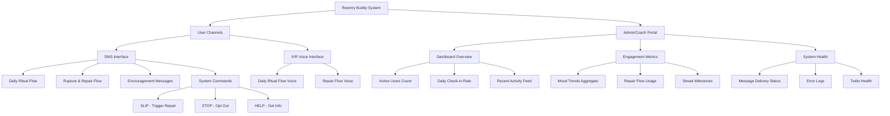
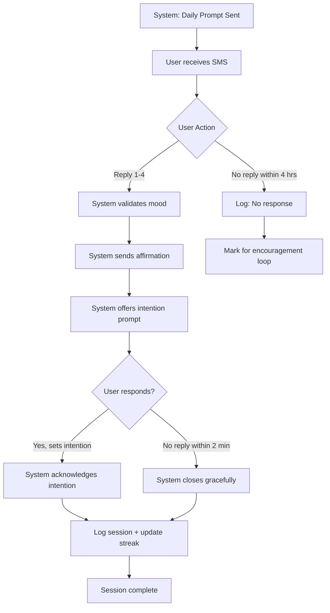
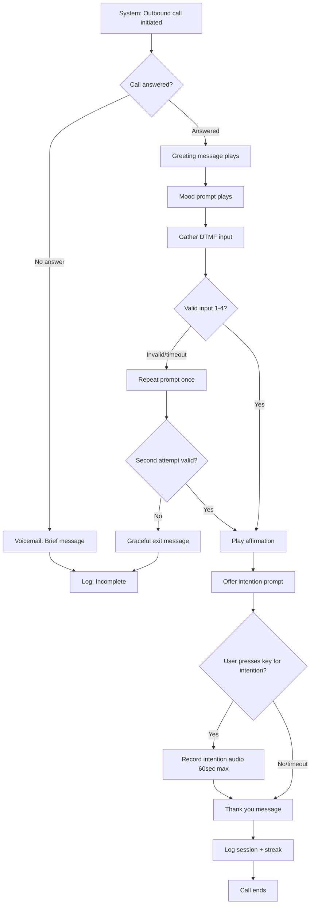
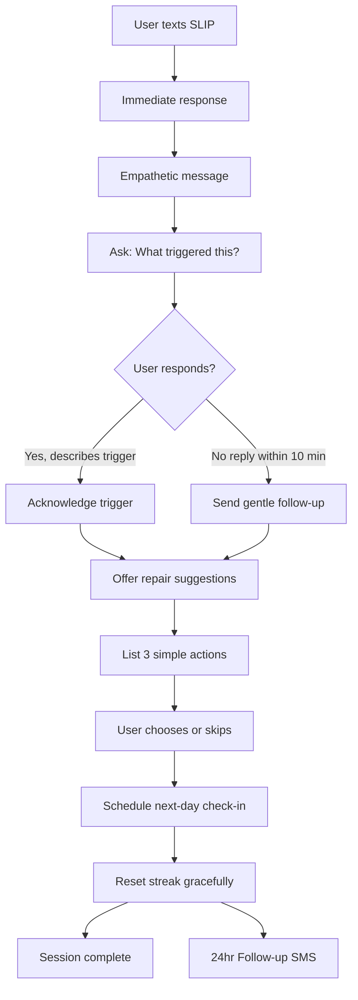
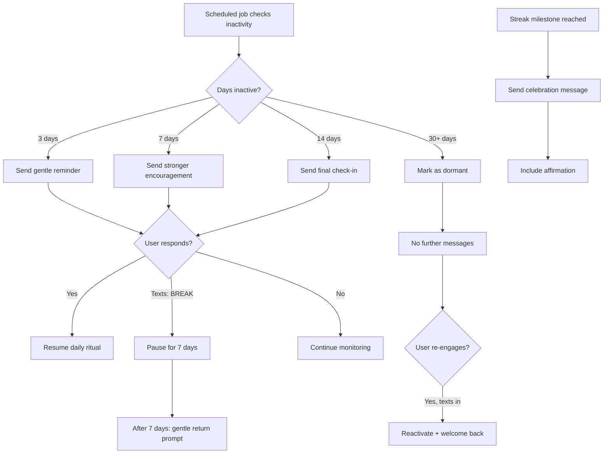

# Reentry Buddy UI/UX Specification

**Version:** v1.0
**Date:** October 10, 2025
**Author:** Sally (UX Expert)
**Status:** Draft - Pending User Testing & Stakeholder Approval

---

## Table of Contents

1. [Introduction](#introduction)
2. [Overall UX Goals & Principles](#overall-ux-goals--principles)
3. [Information Architecture](#information-architecture)
4. [User Flows](#user-flows)
5. [Wireframes & Mockups](#wireframes--mockups)
6. [Component Library / Design System](#component-library--design-system)
7. [Branding & Style Guide](#branding--style-guide)
8. [Accessibility Requirements](#accessibility-requirements)
9. [Responsiveness Strategy](#responsiveness-strategy)
10. [Animation & Micro-interactions](#animation--micro-interactions)
11. [Performance Considerations](#performance-considerations)
12. [Next Steps](#next-steps)
13. [Change Log](#change-log)

---

## Introduction

This document defines the user experience goals, information architecture, user flows, and interface specifications for **Reentry Buddy**'s interaction system. It serves as the foundation for conversational interface design (SMS/IVR) and any administrative dashboard development, ensuring a trauma-informed, accessible, and user-centered experience.

### Project Context

Reentry Buddy is a digital recovery support system designed for justice-impacted individuals reentering society after incarceration. The primary interface is **SMS and IVR (text messages and voice calls)**, not a traditional app or website. This specification adapts UX best practices for conversational interfaces while planning for a Phase 2 admin dashboard for partner coaches.

---

## Overall UX Goals & Principles

### Target User Personas

#### Primary User: Returning Citizen (Justice-Impacted Individual)

- **Context:** Within 12 months of release, active substance use recovery, limited digital literacy
- **Device Access:** Basic flip phone or prepaid smartphone with limited data
- **Reading Level:** 6th grade or below preferred
- **Trust Level:** Low initial trust in technology and institutions
- **Needs:** Structure, consistency, compassion, non-judgmental support

#### Secondary User: Recovery Coach/Case Manager

- **Context:** Partner organization staff supporting returning citizens
- **Device Access:** Smartphone or desktop computer
- **Needs:** Aggregate insights (not individual PII), simple reporting, minimal training required

### Usability Goals

1. **Zero-barrier access:** Any user can complete core tasks via SMS or voice call without smartphone, app installation, or data plan
2. **Rapid comprehension:** Message content understandable within 3 seconds of reading/hearing
3. **Emotional safety:** Every interaction reinforces progress and provides non-judgmental support
4. **Reliability:** System responds within 10 seconds; users trust it will always be there
5. **Respectful privacy:** Users feel confident their information is anonymous and protected

### Design Principles

1. **Radical Simplicity** - Every word, every step must serve a clear purpose. Remove all friction.
2. **Compassion First** - Language acknowledges struggle without judgment. "SLIP" not "relapse."
3. **Progressive Disclosure** - Start with the simplest flow; reveal options only when needed.
4. **Consistent Ritual** - Predictable patterns build trust and reduce cognitive load.
5. **Accessible by Default** - Design for the most constrained user; everyone benefits.

---

## Information Architecture

### Site Map / Screen Inventory



### Navigation Structure

**Primary "Navigation" (User Experience):**
- **State-driven conversation:** Users navigate through flows via SMS replies (1-4) or DTMF tones (voice)
- **Keyword commands:** Special keywords (`SLIP`, `STOP`, `HELP`) allow users to "jump" to different flows
- **Time-based triggers:** System initiates conversations at scheduled times (daily ritual prompt)

**Secondary Navigation (Admin Portal - Phase 2):**
- **Top Navigation:** Dashboard | Metrics | System Health | Settings
- **No deep hierarchy:** Maximum 2 levels to keep admin interface simple
- **Breadcrumb Strategy:** Not needed for shallow navigation structure

---

## User Flows

### Flow 1: Daily Ritual Flow (SMS)

**User Goal:** Complete a 2-5 minute grounding check-in to build consistent recovery habits

**Entry Points:**
- Scheduled SMS prompt sent at user's preferred time (e.g., 9:00 AM)
- User can also initiate by texting "CHECK" or "START" (optional keyword)

**Success Criteria:**
- User completes mood selection
- User receives affirmation
- Session logged with streak update

#### Flow Diagram



#### Edge Cases & Error Handling

- **Invalid response (not 1-4):** Send clarification: "Please reply with a number: 1=Struggling, 2=Getting by, 3=Good, 4=Great"
- **Multiple rapid replies:** Process first valid response, ignore duplicates within 5 seconds
- **User texts during wrong time:** System responds: "Thanks for reaching out! Your daily check-in will arrive tomorrow at [time]. Need support now? Text SLIP or HELP."
- **Delivery failure:** Retry once after 5 minutes; log failure for monitoring
- **User replies after timeout:** Accept late check-in, log as "late completion," still count toward streak

**Notes:**
- Affirmation content should vary based on mood (1-4) to feel personalized
- Streak milestone messages (5, 10, 30 days) can be injected here
- Intention prompt is optional—many users will not set one, and that's okay

---

### Flow 2: Daily Ritual Flow (IVR/Voice)

**User Goal:** Complete daily check-in via voice call (for users who can't/won't text)

**Entry Points:**
- System places outbound call at scheduled time
- User can call Twilio number directly

**Success Criteria:**
- User completes DTMF mood selection (press 1-4)
- User hears affirmation message
- Session logged

#### Flow Diagram



#### Edge Cases & Error Handling

- **Call dropped mid-flow:** Mark as incomplete; send follow-up SMS: "We got disconnected. Text 1-4 to finish your check-in."
- **Background noise/unclear input:** System should be forgiving—accept any DTMF 1-4 without voice recognition complexity
- **User talks instead of pressing keys:** Play gentle redirect: "Please press a number from 1 to 4 on your phone"
- **Voicemail reached:** Leave brief message: "This is Reentry Buddy. We'll try again tomorrow. You can also text us anytime at [number]."
- **User calls during off-hours:** Play message: "Your daily check-in will be available tomorrow at [time]. For immediate support, press 1 for resources."

**Notes:**
- Voice recordings for intentions are optional and stored in S3 with 7-day TTL (60-second maximum)
- Consider accessibility: slower speech pace, clear enunciation, minimal background music
- Bilingual IVR (Phase 2): "Para español, oprima 2"

---

### Flow 3: Rupture & Repair Flow ("SLIP")

**User Goal:** Receive compassionate, non-judgmental support after a relapse moment

**Entry Points:**
- User texts "SLIP" keyword at any time
- System detects prolonged absence (7+ days) and offers repair flow

**Success Criteria:**
- User receives immediate empathetic response
- User identifies trigger (optional)
- User receives repair suggestion
- Follow-up scheduled for next day

#### Flow Diagram



#### Edge Cases & Error Handling

- **Multiple SLIP messages in one day:** Respond to first; subsequent ones get: "We're here with you. Check in tomorrow and let us know how you're doing."
- **SLIP during active ritual flow:** Pause ritual, switch to repair flow immediately
- **User texts SLIP but then goes silent:** Schedule follow-up anyway; don't assume crisis
- **Trigger description is concerning (suicidal ideation):** Have pre-approved crisis resource message ready: "If you're in crisis, call 988 (Suicide & Crisis Lifeline). We'll check in with you tomorrow."

**Notes:**
- "Reset streak gracefully" means: Don't say "Streak broken." Say: "Your 12-day progress isn't lost—you're building skills every day. Let's start fresh tomorrow."
- Repair suggestions should be micro-actions: "Take 3 deep breaths," "Drink a glass of water," "Text one person who cares"
- Follow-up message should reference the SLIP without dwelling on it: "Checking in today. How are you feeling?"

---

### Flow 4: Encouragement Loop

**User Goal:** Receive gentle re-engagement prompts when inactive

**Entry Points:**
- System detects 3+ days of missed check-ins
- Streak milestone achieved (5, 10, 30, 60 days)

**Success Criteria:**
- User receives contextual motivational message
- Message includes clear re-entry point
- Does not feel punitive or nagging

#### Flow Diagram



#### Edge Cases & Error Handling

- **User replies "STOP" to encouragement message:** Honor opt-out immediately
- **User explains absence (jail, hospital):** System should accept any reply as engagement; offer to resume
- **Encouragement sent right after SLIP flow:** Delay encouragement by 48 hours to avoid overwhelming user
- **User hits 30 days inactive but then returns:** Warm welcome message, no guilt

**Notes:**
- Tone progression: Day 3 = "We miss you," Day 7 = "You matter to us," Day 14 = "We're still here"
- Milestone celebrations should be brief and genuine: "30 days of showing up for yourself. That takes courage."
- Avoid excessive celebration that might feel patronizing
- **NEW: "Taking a break" option** allows users to pause messages without opting out entirely

---

## Wireframes & Mockups

### Primary Design Files

**SMS/IVR Content Repository:** Message templates will be stored in JSON configuration files within the codebase (e.g., `/config/messages.json`), allowing non-technical content updates without code changes.

**Admin Dashboard Design:** To be created in Figma or similar tool (link TBD based on team preference).

---

### Key Screen Layouts (SMS Conversations)

#### Screen 1: Daily Ritual Flow (SMS Conversation)

**Purpose:** Show the actual SMS conversation experience from the user's phone perspective

```
┌─────────────────────────────────┐
│  Reentry Buddy          9:00 AM │
├─────────────────────────────────┤
│                                 │
│  ┌───────────────────────────┐ │
│  │ Good morning! How are you │ │
│  │ feeling today?            │ │
│  │                           │ │
│  │ 1 = Struggling            │ │
│  │ 2 = Getting by            │ │
│  │ 3 = Good                  │ │
│  │ 4 = Great                 │ │
│  └───────────────────────────┘ │
│                                 │
│              ┌────────────────┐ │
│              │ 2              │ │
│              └────────────────┘ │
│                        9:02 AM  │
│                                 │
│  ┌───────────────────────────┐ │
│  │ Getting by is honest.     │ │
│  │ That takes strength.      │ │
│  └───────────────────────────┘ │
│                                 │
│  ┌───────────────────────────┐ │
│  │ Want to set an intention  │ │
│  │ for today? (Optional -    │ │
│  │ just reply or skip)       │ │
│  └───────────────────────────┘ │
│                                 │
│              ┌────────────────┐ │
│              │ Stay calm      │ │
│              └────────────────┘ │
│                        9:04 AM  │
│                                 │
│  ┌───────────────────────────┐ │
│  │ "Stay calm" - got it. We  │ │
│  │ believe in you. Talk      │ │
│  │ tomorrow!                 │ │
│  └───────────────────────────┘ │
└─────────────────────────────────┘
```

---

#### Screen 2: SLIP (Rupture & Repair) Flow

**Purpose:** Show the compassionate crisis response experience

```
┌─────────────────────────────────┐
│  Reentry Buddy          2:47 PM │
├─────────────────────────────────┤
│                                 │
│              ┌────────────────┐ │
│              │ SLIP           │ │
│              └────────────────┘ │
│                        2:47 PM  │
│                                 │
│  ┌───────────────────────────┐ │
│  │ We're here with you.      │ │
│  │ You're not alone. 💙       │ │
│  └───────────────────────────┘ │
│                      2:47 PM    │
│                                 │
│  ┌───────────────────────────┐ │
│  │ Slips happen. What        │ │
│  │ matters is what comes     │ │
│  │ next.                     │ │
│  └───────────────────────────┘ │
│                                 │
│  ┌───────────────────────────┐ │
│  │ If you want to share,     │ │
│  │ what triggered this?      │ │
│  │ (You can also skip)       │ │
│  └───────────────────────────┘ │
│                                 │
│              ┌────────────────┐ │
│              │ Saw my old     │ │
│              │ friend         │ │
│              └────────────────┘ │
│                        2:50 PM  │
│                                 │
│  ┌───────────────────────────┐ │
│  │ That's really hard. Old   │ │
│  │ connections can trigger   │ │
│  │ old patterns.             │ │
│  └───────────────────────────┘ │
│                                 │
│  ┌───────────────────────────┐ │
│  │ Here are 3 things you     │ │
│  │ can do right now:         │ │
│  │                           │ │
│  │ • Take 5 deep breaths     │ │
│  │ • Drink a glass of water  │ │
│  │ • Text someone who cares  │ │
│  │                           │ │
│  │ Which one feels doable?   │ │
│  └───────────────────────────┘ │
│                                 │
│              ┌────────────────┐ │
│              │ Water          │ │
│              └────────────────┘ │
│                        2:52 PM  │
│                                 │
│  ┌───────────────────────────┐ │
│  │ Good choice. We'll check  │ │
│  │ in with you tomorrow.     │ │
│  │ You matter to us.         │ │
│  └───────────────────────────┘ │
└─────────────────────────────────┘
```

---

#### Screen 3: Encouragement Message with "Taking a Break" Option

**Purpose:** Re-engage inactive users while respecting their agency

```
┌─────────────────────────────────┐
│  Reentry Buddy          9:00 AM │
├─────────────────────────────────┤
│                                 │
│  ┌───────────────────────────┐ │
│  │ Hey, we miss you.         │ │
│  └───────────────────────────┘ │
│                                 │
│  ┌───────────────────────────┐ │
│  │ No pressure—just          │ │
│  │ checking in. Reply        │ │
│  │ anytime, or text BREAK    │ │
│  │ if you need space.        │ │
│  │                           │ │
│  │ We'll be here.            │ │
│  └───────────────────────────┘ │
│                                 │
│              ┌────────────────┐ │
│              │ BREAK          │ │
│              └────────────────┘ │
│                        9:15 AM  │
│                                 │
│  ┌───────────────────────────┐ │
│  │ Got it. Taking a break is │ │
│  │ okay.                     │ │
│  └───────────────────────────┘ │
│                                 │
│  ┌───────────────────────────┐ │
│  │ We'll check back in a     │ │
│  │ week. Text START anytime  │ │
│  │ you're ready.             │ │
│  │                           │ │
│  │ You matter to us.         │ │
│  └───────────────────────────┘ │
└─────────────────────────────────┘
```

---

#### Screen 4: Admin Dashboard - Overview (Web Interface)

**Purpose:** Provide coaches with weekly aggregate insights without exposing PII

```
┌─────────────────────────────────────────────────────────────┐
│  Reentry Buddy Admin Dashboard        [Week: Oct 3-9, 2025] │
├─────────────────────────────────────────────────────────────┤
│                                                               │
│  ┌──────────────┐  ┌──────────────┐  ┌──────────────┐      │
│  │ Active Users │  │ Check-in Rate│  │ SLIP Events  │      │
│  │              │  │              │  │              │      │
│  │     42       │  │     78%      │  │      5       │      │
│  │   ↑ +3       │  │   ↑ +5%      │  │   ↓ -2       │      │
│  └──────────────┘  └──────────────┘  └──────────────┘      │
│                                                               │
│  ┌─────────────────────────────────────────────────────┐    │
│  │ Mood Trends (Aggregate - This Week)                 │    │
│  │                                                      │    │
│  │  [Bar Chart showing distribution]                   │    │
│  │  Struggling (1): ███████ 18%                        │    │
│  │  Getting By (2): ████████████████ 42%               │    │
│  │  Good (3):       ██████████ 28%                     │    │
│  │  Great (4):      ████ 12%                           │    │
│  └─────────────────────────────────────────────────────┘    │
│                                                               │
│  ┌───────────────────────┐  ┌────────────────────────────┐  │
│  │ Engagement Patterns   │  │ System Health              │  │
│  │                       │  │                            │  │
│  │ Streak Milestones:    │  │ ✅ SMS Delivery: 99.2%     │  │
│  │  • 5 days:  8 users   │  │ ✅ IVR Availability: 100%  │  │
│  │  • 10 days: 6 users   │  │ ✅ Avg Response: 2.3s      │  │
│  │  • 30 days: 2 users   │  │                            │  │
│  │                       │  │                            │  │
│  │ Re-engagement:        │  │ [View Error Log]           │  │
│  │  • Returned: 4 users  │  │                            │  │
│  │  • On break: 7 users  │  │                            │  │
│  └───────────────────────┘  └────────────────────────────┘  │
│                                                               │
│  [Export Weekly Report]  [View Previous Weeks]               │
│                                                               │
└─────────────────────────────────────────────────────────────┘
```

---

## Component Library / Design System

### Design System Approach

**For SMS/IVR Interface:**
We will create a **Message Pattern Library** - reusable message templates with consistent tone, structure, and formatting rules.

**For Admin Dashboard (Phase 2):**
We will use an existing design system to accelerate development:
- **Recommendation:** Tailwind UI or shadcn/ui (React-based, accessible by default)
- **Rationale:** Fast implementation, well-documented, accessible out-of-the-box

---

### Core Message Patterns (SMS/IVR)

#### Pattern 1: Prompt Message

**Purpose:** Ask user for input (mood, trigger, etc.)

**Structure:**
```
[Greeting] [Question] [Options with numbers]
```

**Examples:**
- "Good morning! How are you feeling today? 1=Struggling 2=Getting by 3=Good 4=Great"
- "What triggered this? 1=Person 2=Place 3=Emotion 4=Other (You can also skip)"

**Usage Guidelines:**
- Always provide 2-4 numbered options
- Keep total message <160 characters when possible
- Make "skip" option explicit if optional

---

#### Pattern 2: Affirmation Message

**Purpose:** Validate user's response and provide emotional support

**Structure:**
```
[Acknowledge emotion] [Affirming statement]
```

**Examples:**
- "Struggling is real. You're here anyway—that's courage."
- "Getting by is honest. That takes strength."
- "Feeling good is a gift. Enjoy it."

**Variants:**
- Response to mood 1 (Struggling): Emphasize courage/persistence
- Response to mood 2 (Getting by): Validate honesty/effort
- Response to mood 3-4 (Good/Great): Celebrate without over-praising

**Usage Guidelines:**
- Never use "but" or minimize emotions
- Keep to 2 sentences maximum
- Avoid excessive exclamation marks (can feel fake)

---

#### Pattern 3: Crisis Response Message

**Purpose:** Provide immediate compassionate support during SLIP moments

**Structure:**
```
[Immediate empathy] [Reframe] [Next step]
```

**Example:**
- Message 1: "We're here with you. You're not alone. 💙"
- Message 2: "Slips happen. What matters is what comes next."
- Message 3: "If you want to share, what triggered this? (You can also skip)"

**States:**
- **Immediate (0-10 seconds):** First empathetic message
- **Supportive (10-30 seconds):** Reframe message
- **Guiding (30+ seconds):** Next step prompt

**Usage Guidelines:**
- First message must arrive <10 seconds
- Use 💙 emoji strategically (pending device compatibility testing)
- Never use words like "relapse," "failure," "mistake"

---

#### Pattern 4: Encouragement Message

**Purpose:** Re-engage inactive users without guilt or pressure

**Structure:**
```
[Gentle observation] [Permission/no pressure] [Clear re-entry option]
```

**Examples:**
- Day 3: "Hey, we miss you. No pressure—just checking in. Reply anytime, or text BREAK if you need space. We'll be here."
- Day 7: "You matter to us. Come back when you're ready. Text START anytime."
- Day 14: "We're still here. Text anytime."

**Usage Guidelines:**
- Escalate warmth, not pressure
- Always include "no pressure" framing
- Provide BREAK option (user agency)

---

#### Pattern 5: Milestone Celebration

**Purpose:** Recognize achievement without excessive enthusiasm

**Structure:**
```
[Achievement statement] [User agency emphasis] [Brief celebration]
```

**Examples:**
- "5 days of showing up for yourself."
- "10 days. That takes commitment."
- "30 days of building new patterns. You did this."

**Usage Guidelines:**
- Keep brief (1-2 sentences)
- Focus on user's agency: "You did this" not "We're so proud"
- Optionally use ✨ for 30+ day milestones (pending testing)

---

## Branding & Style Guide

### Visual Identity

**User-Facing Brand:** **Reentry Buddy**
- Tone: Warm, friendly, accessible
- Voice: First-person ("we"), conversational
- Purpose: Build trust and emotional connection

**Institutional Brand:** **Reentry Companion**
- Tone: Professional, respectful, evidence-based
- Voice: Third-person formal (for grants, partnerships)
- Purpose: Establish credibility with funders and institutions

**Brand Guidelines:** To be developed (no existing guideline link at this time)

---

### Color Palette (Admin Dashboard - Phase 2)

Since the primary interface is SMS/IVR (no colors visible to end users), color palette applies only to the admin dashboard.

| Color Type | Hex Code | Usage |
|------------|----------|-------|
| Primary | #2563EB (Blue) | Primary actions, links, active states |
| Secondary | #7C3AED (Purple) | Secondary actions, highlights |
| Accent | #10B981 (Green) | Success states, positive metrics |
| Success | #059669 (Dark Green) | Confirmations, streak achievements |
| Warning | #F59E0B (Amber) | Cautions, approaching thresholds |
| Error | #DC2626 (Red) | Errors, failed deliveries |
| Neutral | #6B7280 (Gray) | Text, borders, backgrounds |

---

### Typography

#### Font Families
- **Primary (Admin Dashboard):** Inter or System UI (sans-serif)
- **Secondary (Documentation):** Georgia or System Serif
- **Monospace (Technical data):** SF Mono or Consolas

**For SMS/IVR:** Typography doesn't apply - messages display in user's device default font.

#### Type Scale (Admin Dashboard)

| Element | Size | Weight | Line Height |
|---------|------|--------|-------------|
| H1 | 30px / 1.875rem | Bold (700) | 1.2 |
| H2 | 24px / 1.5rem | Semibold (600) | 1.3 |
| H3 | 20px / 1.25rem | Semibold (600) | 1.4 |
| Body | 16px / 1rem | Regular (400) | 1.5 |
| Small | 14px / 0.875rem | Regular (400) | 1.4 |

---

### Iconography

**Icon Library:** Heroicons or Lucide (open-source, accessible)

**Usage Guidelines:**
- Use icons sparingly in admin dashboard
- Always pair icons with text labels (accessibility)
- 20px minimum touch target for interactive icons

**SMS/IVR:** Emojis only (💙, ✨) - pending user testing validation

---

### Spacing & Layout

**Grid System:** 8px base unit (multiples of 8 for consistent spacing)

**Spacing Scale:**
- xs: 4px
- sm: 8px
- md: 16px
- lg: 24px
- xl: 32px
- 2xl: 48px

**Admin Dashboard Layout:**
- Max content width: 1280px
- Padding: 24px (desktop), 16px (mobile)
- Card spacing: 16px gap between elements

---

### SMS/IVR-Specific Style Guidelines

Since users experience the system through text and voice, "style" manifests in **tone and language**:

#### Tone Principles
1. **Conversational, not clinical:** "We're here with you" not "System activated"
2. **Direct, not vague:** "Text SLIP" not "Reach out if needed"
3. **Affirming, not judgmental:** "Getting by is honest" not "Improve your mood"
4. **Brief, not wordy:** Max 2 sentences per message when possible

#### Language Rules
- **Reading level:** 6th grade or below
- **Sentence structure:** Subject-verb-object (simple)
- **Word choice:** Common words, avoid jargon
- **Active voice:** "You're building skills" not "Skills are being built"
- **Contractions:** Use naturally ("you're" not "you are")

#### Forbidden Words/Phrases
- ❌ "Relapse" → Use "SLIP"
- ❌ "Failure" → Use "tough moment"
- ❌ "Missed" → Use "we miss you"
- ❌ "Streak broken" → Use "let's start fresh"
- ❌ "Try harder" → Use "take it one day at a time"

---

## Accessibility Requirements

### Compliance Target

**Standard:** WCAG 2.1 Level AA (minimum)

**Rationale:** Level AA is the industry standard for public-facing digital tools and ensures broad accessibility without the complexity of AAA requirements.

---

### Key Requirements

#### Visual (Admin Dashboard - Phase 2)

**Color contrast ratios:**
- Text: 4.5:1 minimum for normal text, 3:1 for large text (18px+)
- Interactive elements: 3:1 minimum for borders and icons
- All color combinations in the palette must meet these ratios

**Focus indicators:**
- Visible keyboard focus outline (2px solid, high-contrast color)
- Focus order follows logical page structure (top-to-bottom, left-to-right)
- Skip-to-main-content link for keyboard users

**Text sizing:**
- User can zoom to 200% without loss of functionality
- No fixed pixel heights on text containers
- Responsive breakpoints preserve readability

#### Interaction

**Keyboard navigation:**
- All interactive elements reachable via Tab key
- Enter/Space activates buttons and links
- Escape closes modals and dropdowns
- Arrow keys navigate within components (dropdowns, date pickers)

**Screen reader support:**
- Semantic HTML5 elements (`<nav>`, `<main>`, `<article>`)
- ARIA labels for icon-only buttons
- ARIA live regions for dynamic content updates (new metrics loading)
- Form inputs have associated `<label>` elements

**Touch targets (for tablet access):**
- Minimum 44×44px touch target for all interactive elements
- 8px minimum spacing between adjacent touch targets

#### Content

**Alternative text:**
- All charts/graphs have text alternatives describing key data
- Decorative images use `alt=""` (null alt)
- Icon buttons have `aria-label` attributes

**Heading structure:**
- Logical hierarchy (H1 → H2 → H3, no skipping)
- One H1 per page (page title)
- Headings describe content accurately

**Form labels:**
- Every input has visible `<label>`
- Error messages clearly associated with fields
- Required fields indicated visually and programmatically

---

### SMS/IVR-Specific Accessibility

**SMS Accessibility:**
- ✅ Accessible to users with visual impairments (screen readers can read texts)
- ✅ Accessible to users with hearing impairments (text-based)
- ✅ Accessible to users with cognitive disabilities (simple language, numbered options)
- ✅ Accessible to users with motor disabilities (minimal input required: 1-4 or simple keywords)

**IVR Accessibility:**
- ✅ Accessible to users with visual impairments (audio-based)
- ✅ Accessible to users with cognitive disabilities (slow speech pace, clear options)
- ⚠️ **Not accessible** to users with hearing impairments (provide SMS alternative)
- ⚠️ **Challenging** for users with speech impairments (use DTMF tones instead of voice recognition)

**Key Design Decisions:**
- Always provide BOTH SMS and IVR options
- Voice recordings for intentions are optional (not required for participation)
- All critical interactions work via DTMF tones (no voice recognition required)

---

### Testing Strategy

**Admin Dashboard Testing:**
1. **Automated tools:**
   - axe DevTools (browser extension) during development
   - Lighthouse accessibility audit (part of CI/CD)
   - WAVE tool (final pre-launch check)

2. **Manual testing:**
   - Keyboard-only navigation test
   - Screen reader test (NVDA on Windows, VoiceOver on Mac)
   - Color contrast validation (WebAIM contrast checker)
   - Zoom test (200% browser zoom)

3. **User testing:**
   - Include at least 1 user with disabilities in pilot testing
   - Test with assistive technologies (screen reader, magnification)

**SMS/IVR Testing:**
1. **Device testing:**
   - Test message display on basic phone screen readers (Android TalkBack, iOS VoiceOver)
   - Validate IVR prompts with slow playback speed option

2. **Cognitive load testing:**
   - Flesch-Kincaid readability score target: 6th grade or below
   - User testing with participants with varying literacy levels
   - Ensure numbered options don't exceed 4 choices (cognitive overload)

3. **Motor accessibility testing:**
   - Validate DTMF tone input on various phone models
   - Ensure generous timeout periods (no rushed responses required)

---

## Responsiveness Strategy

### Breakpoints (Admin Dashboard Only)

Since SMS/IVR interfaces are device-agnostic, responsiveness only applies to the Phase 2 admin dashboard.

| Breakpoint | Min Width | Max Width | Target Devices |
|------------|-----------|-----------|----------------|
| Mobile | 0px | 639px | Smartphones (portrait) |
| Tablet | 640px | 1023px | Tablets (portrait/landscape), large phones |
| Desktop | 1024px | 1279px | Laptops, small desktop monitors |
| Wide | 1280px | - | Large desktop monitors, external displays |

---

### Adaptation Patterns

**Layout Changes:**
- **Mobile:** Single-column layout, stacked metric cards
- **Tablet:** 2-column grid for metric cards, side-by-side charts
- **Desktop:** 3-column grid for metrics, expanded charts with more detail
- **Wide:** Max width of 1280px to prevent excessive line lengths

**Navigation Changes:**
- **Mobile:** Hamburger menu (collapsible)
- **Tablet/Desktop:** Horizontal tab navigation
- **Wide:** Persistent sidebar navigation (optional enhancement)

**Content Priority:**
- **Mobile:** Show only current week metrics, hide historical comparison
- **Tablet:** Add week-over-week comparison
- **Desktop:** Show full historical trends and detailed breakdowns
- **Wide:** Add additional context (chart legends, annotations)

**Interaction Changes:**
- **Mobile:** Larger touch targets (48×48px minimum), simplified date picker
- **Tablet:** Standard touch targets (44×44px), full-featured date picker
- **Desktop:** Mouse-optimized interactions, hover states, tooltips
- **Wide:** No changes from desktop

---

## Animation & Micro-interactions

### Motion Principles

For this project, animation strategy differs significantly between the SMS/IVR interface (minimal/none) and the admin dashboard (subtle enhancements).

**Overall Principles:**
1. **Purpose over decoration** - Every animation must serve a functional purpose
2. **Respect user preferences** - Honor `prefers-reduced-motion` system setting
3. **Performance first** - Animations must never cause lag or delay critical content
4. **Subtle over showy** - Understated transitions build trust; flashy animations feel unprofessional

---

### Key Animations (Admin Dashboard - Phase 2)

- **Loading States:** Skeleton screens fade in → actual content cross-fades (300ms, ease-in-out)
- **Metric Updates:** Numbers count up from previous value to new value (800ms, ease-out)
- **Chart Transitions:** Bars/lines animate from 0 to value on first load (600ms, cubic-bezier)
- **Notification Toasts:** Slide in from top, fade out after 5 seconds (250ms in, 200ms out)
- **Modal Open/Close:** Fade + scale 0.95 → 1.0 (200ms, ease-in-out)

---

### SMS/IVR "Micro-interactions"

Since there's no visual animation in SMS/IVR, "micro-interactions" manifest as **timing and sequencing**:

#### Message Delivery Timing
- **Immediate response** (<2 seconds): System confirms receipt of user input
- **Sequential messages** (1-2 second delay): Creates conversational rhythm
- **Follow-up messages** (24 hours later): Demonstrates system reliability

#### IVR Audio Cues
- **Confirmation tone:** Brief audible beep after DTMF input (200ms)
- **Transition pause:** 500ms silence between prompt sections
- **Completion tone:** Pleasant chime after session complete (300ms)

---

## Performance Considerations

### Performance Goals

**SMS/IVR:**
- **Message delivery:** <10 seconds from trigger to user receipt
- **Response latency:** <2 seconds from user input to system reply
- **IVR pickup:** <3 rings for outbound calls, instant for inbound

**Admin Dashboard:**
- **Page load:** <2 seconds for initial paint (LCP)
- **Interaction response:** <100ms for UI feedback (e.g., button click)
- **Chart rendering:** <500ms for data visualization

### Design Strategies

**SMS/IVR Performance:**
1. **Message queuing:** Pre-render common messages to reduce generation time
2. **Twilio optimization:** Use Messaging Service for better deliverability/speed
3. **IVR pre-loading:** Cache audio files at CDN edge locations

**Admin Dashboard Performance:**
1. **Code splitting:** Load dashboard components only when needed
2. **Data pagination:** Limit initial data load to current week
3. **Lazy loading:** Defer chart rendering until viewport visible
4. **Caching:** Cache static metrics data for 5-minute intervals
5. **Image optimization:** Use WebP format, responsive image sizing

---

## Next Steps

### Immediate Actions

1. **Stakeholder Review** - Share this document with Alex (PM), Winston (Architect), and Mary (Analyst) for feedback and approval

2. **User Testing Preparation** - Begin recruiting 5-10 participants using materials in [docs/testing/recruitment-and-consent.md](docs/testing/recruitment-and-consent.md)

3. **Message Template Development** - Create JSON configuration files for all message patterns defined in Component Library section

4. **Twilio Sandbox Testing** - Validate message delivery timing, character limits, and emoji rendering on target devices

5. **Define Voice Recordings** - Script and record IVR audio prompts (or identify text-to-speech provider)

6. **Admin Dashboard Planning** - Finalize design system choice (Tailwind UI vs. shadcn/ui) and create initial wireframes in Figma (Phase 2)

---

### Design Handoff Checklist

Before handoff to Winston (Design Architect) for frontend architecture:

- [x] All user flows documented with Mermaid diagrams
- [x] Component inventory complete (message patterns defined)
- [x] Accessibility requirements defined (WCAG 2.1 AA)
- [x] Responsive strategy clear (admin dashboard breakpoints)
- [x] Brand guidelines incorporated (tone, language rules)
- [x] Performance goals established (<10s message delivery, <2s page load)
- [ ] User testing complete (5-10 participants, results analyzed)
- [ ] Revised message templates based on testing feedback
- [ ] SMS mockups finalized (5 core screens documented)
- [ ] IVR audio scripts finalized

---

### Open Questions & Decisions Needed

1. **Spanish Language Support Timeline:** Confirm whether bilingual support should be architected in Phase 1 (even if content comes later) or deferred to Phase 2 entirely

2. **Voice Recording Strategy:** Should intentions be recorded audio (stored in S3) or transcribed text (via Twilio speech-to-text)? Cost and privacy implications differ.

3. **Admin Dashboard Priority:** Is Phase 2 admin dashboard required before pilot launch, or can pilot run with CloudWatch monitoring only?

4. **Emoji Usage Final Decision:** Pending user testing results - keep 💙 in SLIP messages, or remove all emojis for broadest device compatibility?

5. **BREAK Keyword Pause Duration:** User testing will determine if 7-day pause is appropriate, or if we need 3-day/14-day options

---

### Testing Materials

Comprehensive user testing materials have been created and saved to:
- [docs/testing/recruitment-and-consent.md](docs/testing/recruitment-and-consent.md) - Recruitment flyer, screening questionnaire, informed consent form
- [docs/testing/session-notes-template.md](docs/testing/session-notes-template.md) - Individual session data collection template
- [docs/testing/analysis-framework.md](docs/testing/analysis-framework.md) - Cross-participant analysis matrix and final report template

---

## Change Log

| Date | Version | Description | Author |
|------|---------|-------------|--------|
| 2025-10-10 | v1.0 | Initial UI/UX specification created | Sally (UX Expert) |
| _TBD_ | v1.1 | Updated based on user testing results | _TBD_ |

---

**Document Metadata**
- **Version:** v1.0
- **Status:** Draft - Pending User Testing & Stakeholder Approval
- **Owner:** Sally (UX Expert)
- **Repository Path:** `/docs/front-end-spec.md`
- **Next Review:** After user testing completion

---

✅ **End of Document**
